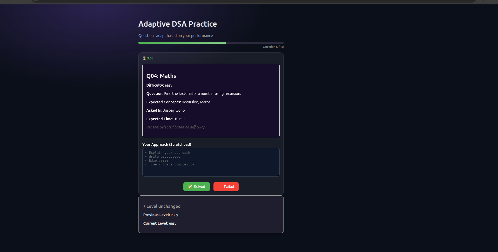
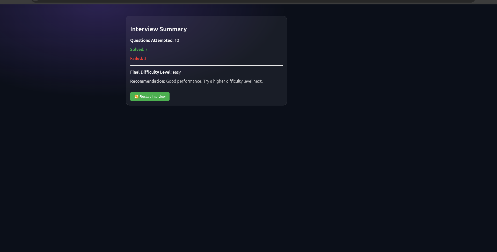

# 🚀 NeuroPrep – Adaptive Interview Simulator (Frontend)

A decision-driven interview simulation frontend built to mimic real FAANG-style technical interviews.

NeuroPrep is not a practice app.  
It is an interview simulation system that visualizes how interviewers dynamically adjust questions based on a candidate's performance.

This frontend consumes an adaptive backend engine that selects questions using difficulty progression, weak-topic prioritization, and interview history.

## 📸 Interview Simulation Screenshots

### 🧠 Question & Timer View


### 📊 Interview Summary & Feedback


Screenshots demonstrate real interview flow, candidate reasoning via scratchpad, and final performance evaluation.

## 🎯 Purpose of This Project

Most coding platforms:

- Show random or static problems
- Ignore candidate performance patterns
- Do not simulate interviewer decision-making

NeuroPrep simulates how real interviewers think:

- 🔼 Adjusts difficulty dynamically
- 🎯 Targets weak topics first
- 🔁 Avoids repetition until exhaustion
- ⏱️ Forces decision pressure
- 🧠 Focuses on reasoning, not just answers

## 🧠 What Makes This Frontend FAANG-Grade

- ✅ Interview-style flow (not list-based solving)
- ✅ State-driven UI (level, progress, decision feedback)
- ✅ Backend-agnostic & production-ready architecture
- ✅ Clean separation of concerns (UI ↔ decision engine)
- ✅ Designed for real users, analytics & extension

## 🖥️ Core Features

- 📌 Question display (topic, difficulty, expected time)
- 📊 Live interview progress (Question 1 → 10)
- ⏳ Per-question timer (auto-fail on timeout)
- 🧠 Scratchpad for candidate reasoning
- 🔁 Adaptive next-question flow
- 🎯 Interview-style action buttons (Solved / Failed)
- 📈 Final interview summary & recommendation
- 🛡️ Graceful handling of edge cases (no crashes)

## 🛠️ Tech Stack

### Frontend
- React (Vite)
- JavaScript (ES6+)
- React Router
- CSS
- Modular component architecture

### Backend (Consumed API)
- Node.js
- Express.js
- Adaptive decision engine
- In-memory state (DB-ready design)

## 📂 Project Structure

```
src/
├── api/
│   └── questionApi.js
├── components/
│   ├── InterviewSimulation.jsx
│   ├── QuestionCard.jsx
│   ├── Scratchpad.jsx
│   ├── Timer.jsx
│   ├── ActionButtons.jsx
│   └── LevelInfo.jsx
├── hooks/
│   └── useQuestionFlow.js
├── pages/
│   ├── PracticePage.jsx
│   └── InterviewSummary.jsx
├── config/
│   └── interviewConfig.js
├── App.jsx
└── main.jsx
```

## 🔌 Backend Integration

### 🌐 Deployed Backend
[https://neuraprep.onrender.com](https://neuraprep.onrender.com)

### 🔑 APIs Used
- GET /api/next-question/:userId
- POST /api/submitResult
- POST /api/reset-session/:userId

### 🧠 Backend Repository
👉 [https://github.com/deb-priyanshu-1617/NeuroPrep-backend](https://github.com/deb-priyanshu-1617/NeuroPrep-backend)

## 🚀 Local Setup

```bash
git clone https://github.com/deb-priyanshu-1617/NeuroPrep-frontend
cd NeuroPrep-frontend
npm install
npm run dev
```

Open in browser: [http://localhost:5173/practice/242](http://localhost:5173/practice/242)

Uses the deployed backend — no local backend setup required.

## 👨‍💻 Author

**Priyanshu Maurya**  
Backend & Systems | DSA | Interview Engineering  
NIET, India

Building systems that think like interviewers — not platforms that dump problems.